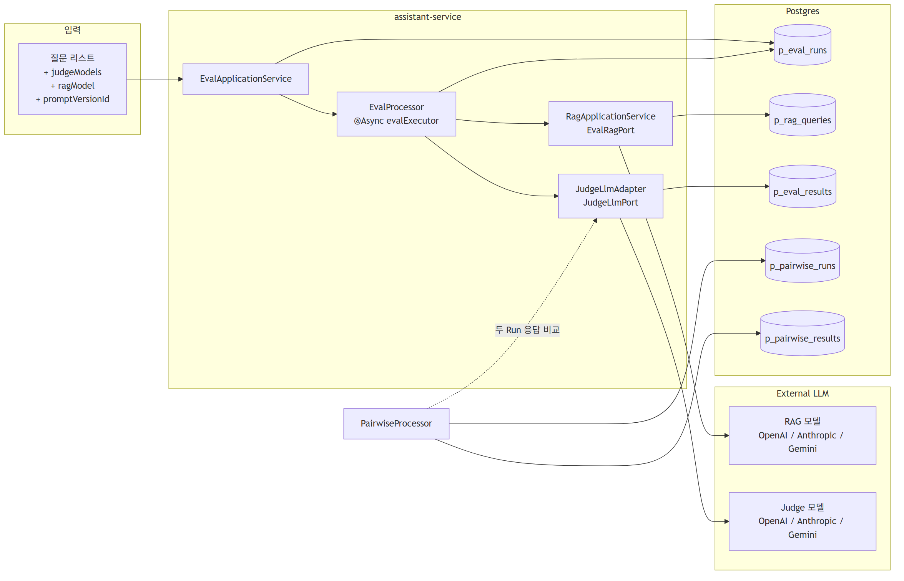
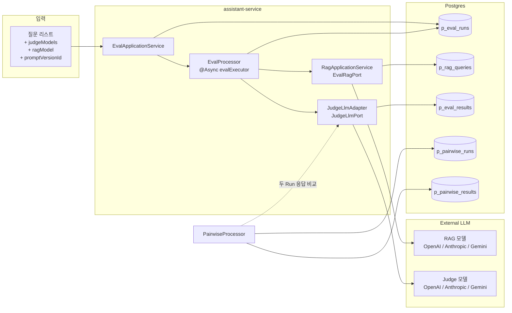
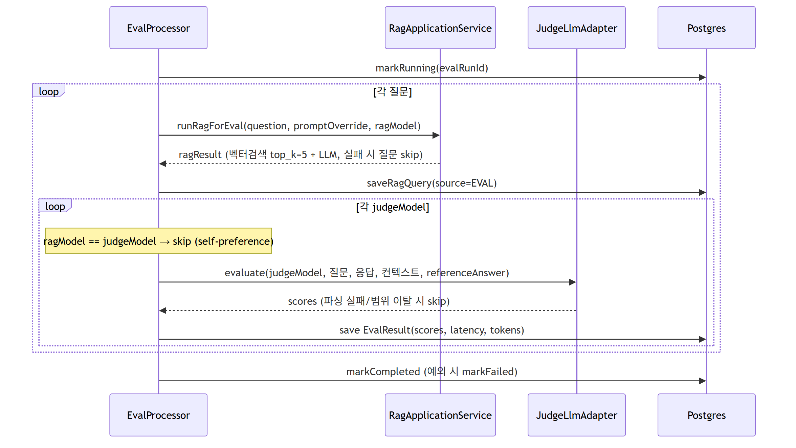
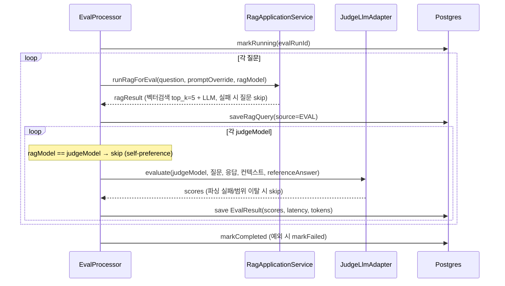
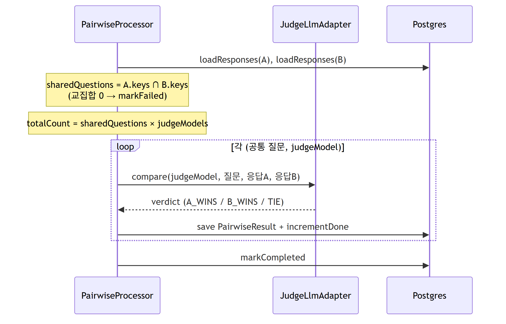
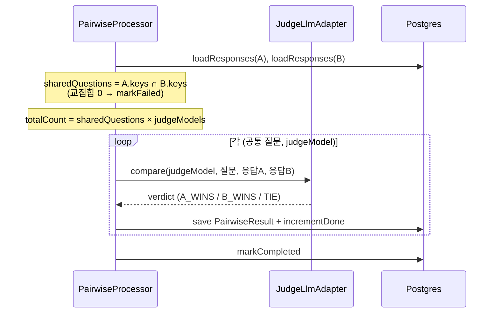

# assistant-service — RAG 정확도 평가 & LLM-as-a-Judge 리포트

> 소스 코드 (`apps/assistant-service/`) 기반으로 작성. 평가 시스템 동작 → 메트릭/프롬프트 → 평가 파이프라인 동작 순서 → 결과 집계 SQL → 리포트 템플릿 순으로 읽으면 됩니다. DB 스키마/파일 위치 등 레퍼런스는 부록(§11·§12)으로 분리했습니다.

---

## 0. 빠른 요약 (TL;DR)

이 서비스는 운영 중인 RAG 챗봇 (모의투자 학습 도우미) 의 답변 품질을 자동으로 평가합니다. 평가 방식 3가지:

| 평가 방식 | 무엇을 보는가 | 점수 형태 |
|---|---|---|
| **Reference-free** | 정답 없이 "컨텍스트만 보고도 잘 답했나" | relevance · faithfulness · contextPrecision |
| **Reference-based** | 사람이 만든 정답과 비교해서 채점 | 동일 3지표 + 정답과의 일치도 반영 |
| **Pairwise** | 두 Run(A vs B) 의 응답을 LLM 이 직접 비교 | A_WINS / B_WINS / TIE |

**핵심 흐름**: 질문 묶음 + Judge 모델 선택 → `POST /api/assistants/evaluations` → 비동기 파이프라인이 RAG 호출 + LLM 채점 → `p_eval_results` 에 점수 저장 → `GET /api/assistants/evaluations` 로 결과 조회.

**LLM-as-a-Judge**: Judge LLM (gpt-4o / claude / gemini 등) 이 정해진 프롬프트로 점수 + 한국어 feedback 을 JSON 으로 반환. Self-preference bias 방지를 위해 **RAG 모델과 동일한 Judge 는 자동 스킵**.

> **점수 척도**: 프롬프트가 **1~5 정수 척도**를 명시적으로 요구합니다 (§4-1·§4-2). JSONB·범위 검증은 소수도 수용하나 실제 채점은 정수로 운영됩니다. 따라서 본 리포트는 점수를 **5점 정수 척도**로 해석합니다.

---

## 1. 리포트 작성 체크리스트

> 결과를 받기 전/후 빠르게 훑는 용도. 각 항목의 상세는 §8(템플릿)·§9(SQL)·§10(한계) 참조.

- [ ] `EvalRun.status = COMPLETED` 확인 (`GET /{evalRunId}/status`)
- [ ] §8-1 메타데이터 — `p_eval_runs` 에서 가져옴. **유효 채점 건수 / 총 시도 건수**, reference-free·based 비율, ref 출처도 함께 기록 (§10-B·§10-F)
- [ ] §8-2 전체 평균 + **환각 비율(%)** — §9-1 SQL. 운영 액션 기준(§8-2 결정 트리)과 대조
- [ ] §8-3 Judge 별 평균 + **Judge 간 분산** — §9-2 SQL (편향 의심 시 의견 칸에 명시)
- [ ] §8-4 점수 분포 — §9-3 SQL (평균만 보지 말 것)
- [ ] §8-5 환각 케이스 5~10개 표본 — §9-4 SQL (LLM feedback 그대로 인용)
- [ ] §8-6 Pairwise (회귀 평가일 때만) — §9-6 SQL + **통계적 유의성(§8-6)** 확인
- [ ] §8-7 종합 결론 — 점수 변화 폭 + 환각 유형 + 다음 액션 3가지 이내
- [ ] 부록: §10 제한사항 footer 첨부 (LLM 평가가 "절대적 진실" 아님을 청자에게 명시)

---

## 2. 평가 시스템 구조도



<details>
<summary>Mermaid 원본 (편집용)</summary>



</details>

> 테이블 상세 컬럼은 **부록 A (§11)** 참조.

---

## 3. 평가 메트릭 — 무엇을 측정하나

| 지표 | 척도 | 의미 |
|---|---|---|
| **relevance** | 1~5 | 응답이 질문 의도에 부합하는가 |
| **faithfulness** | 1~5 | 응답이 컨텍스트에 근거하는가 (환각 방지) |
| **contextPrecision** | 1~5 | 검색된 컨텍스트가 응답에 유용하게 활용되었나 |
| **feedback** | 문자열 | Judge LLM 의 한국어 코멘트 (정성 분석 raw input, §9-5 참조) |
| **hallucinationCount** | 정수 | faithfulness < 3.0 인 건수 (집계 지표 — 운영 시 **비율(%)** 로 환산 권장, §8-2) |

**점수 가이드** (Judge 프롬프트 내장, 정수 앵커):

| 5 | 4 | 3 | 2 | 1 |
|---|---|---|---|---|
| 완벽 | 양호 | 보통 | 불량 | 완전히 틀림 |

**`scores` JSONB 저장 형식** (메트릭 ↔ 저장형식 연결)

```json
{"relevance": 4.0, "faithfulness": 4.0, "contextPrecision": 4.0, "feedback": "컨텍스트 잘 활용함"}
```

> 프롬프트가 1~5 정수 척도를 명시하므로 Judge 는 정수로 채점합니다 (§4-1·§4-2, §4-5a 적용).

---

## 4. Judge LLM 프롬프트 (코드 그대로)

> 4-1 ~ 4-4 는 **현행 코드** 그대로입니다. 4-1·4-2 에는 이미 아래 4-5 의 (a)·(b)·(d) 가 반영되어 있습니다 (정수 척도 / CoT / faithfulness 3분류). 4-5 는 적용 현황과 남은 제안을 정리합니다.

### 4-1. Reference-Free 채점 시스템 프롬프트

```
당신은 RAG(Retrieval-Augmented Generation) 품질 평가 전문가입니다.
아래 기준으로 AI 어시스턴트의 응답을 1~5점 정수 척도로 평가하세요.

- relevance(관련성): 응답이 질문의 의도에 정확히 부합하는가?
- faithfulness(충실도): 응답이 제공된 컨텍스트에 근거하는가? (환각 방지)
  · 컨텍스트와 모순되는 내용 → 3점 미만 (환각)
  · 컨텍스트에 없는 사실·수치·종목명을 지어냄 → 3점 미만 (환각)
  · 컨텍스트에 없지만 일반 상식 수준의 보충 설명 → 감점하지 않거나 약하게만 감점
- contextPrecision(맥락 정확도): 검색된 컨텍스트가 응답에 유용하게 활용되었는가?

점수 가이드: 5=완벽  4=양호  3=보통  2=불량  1=완전히 틀림

먼저 feedback에 채점 근거를 한두 문장으로 서술한 뒤, 그 근거에 맞춰 점수를 매기세요.
마크다운 없이 아래 JSON만 키 순서 그대로 반환하세요:
{"feedback":"<채점 근거 한두 문장, 한국어>","relevance":<1-5>,"faithfulness":<1-5>,"contextPrecision":<1-5>}
```

### 4-2. Reference-Based 채점 시스템 프롬프트

```
당신은 RAG(Retrieval-Augmented Generation) 품질 평가 전문가입니다.
제공된 정답을 기준으로 AI 어시스턴트의 응답을 1~5점 정수 척도로 평가하세요.

- relevance(관련성): 응답이 질문의 의도에 정확히 부합하는가?
- faithfulness(충실도): 응답이 정답 및 컨텍스트에 근거하는가?
  · 정답·컨텍스트와 모순되는 내용 → 3점 미만
  · 정답·컨텍스트에 없는 사실·수치·종목명을 지어냄 → 3점 미만
  · 일반 상식 수준의 보충 설명 → 감점하지 않거나 약하게만 감점
- contextPrecision(맥락 정확도): 검색된 컨텍스트가 응답에 유용하게 활용되었는가?

점수 가이드: 5=완벽  4=양호  3=보통  2=불량  1=완전히 틀림

먼저 feedback에 채점 근거를 한두 문장으로 서술한 뒤, 그 근거에 맞춰 점수를 매기세요.
마크다운 없이 아래 JSON만 키 순서 그대로 반환하세요:
{"feedback":"<채점 근거 한두 문장, 한국어>","relevance":<1-5>,"faithfulness":<1-5>,"contextPrecision":<1-5>}
```

**user 메시지 구조 (참고)**: 위 system 프롬프트와 별개로, 실제 user 메시지에 `질문 / 검색 컨텍스트 / AI 응답 / referenceAnswer(있을 때만)` 가 슬롯으로 주입됩니다 (조립은 `JudgeLlmAdapter`). reference-based 는 `referenceAnswer` 슬롯이 채워진 경우이며, `null` 이면 사실상 reference-free 채점이 됩니다 (§10-F).

### 4-3. Pairwise 비교 시스템 프롬프트

```
당신은 RAG 응답 품질 비교 전문가입니다.
아래 두 AI 응답 중 어느 쪽이 질문에 더 정확하고 충실하게 답변했는지 판정하세요.

판정 기준: 관련성, 사실적 정확성, 컨텍스트 활용도
결과: "A", "B", "TIE" 중 하나만 반환하세요. 다른 텍스트는 절대 포함하지 마세요.
```

> **표기 매핑**: 프롬프트는 `"A" / "B" / "TIE"` 를 받지만 DB(`p_pairwise_results.verdict`)에는 `A_WINS / B_WINS / TIE` 로 저장됩니다. 변환은 어댑터/프로세서(`JudgeLlmAdapter` → `PairwiseProcessor`)에서 수행됩니다.

### 4-4. Judge 호출 설정 (`JudgeLlmAdapter`)

- **모든 Judge 모델 temperature = 0.0** (결정성 보장)
- JSON 파싱 실패 / 범위 이탈 (`1.0 ≤ score ≤ 5.0`) 시 해당 채점만 skip (warn 로그) → 평균의 분모가 줄어듦 (§10-B)
- **Self-preference bias 방지**: `ragModel.equals(judgeModel)` 인 조합은 자동 skip
- Provider 결정 규칙 (`Provider.from(modelName)`): prefix `gpt` → OPENAI, `claude` → ANTHROPIC, `gemini` → GEMINI (기본값 OPENAI)

### 4-5. 프롬프트 개선 — 적용 현황 & 남은 제안

> **로직 변경 없이 프롬프트만으로** 가능한 (a)·(b)·(d) 는 4-1·4-2 에 **적용 완료**. (c)·(e) 는 코드 수정이 필요해 보류.

**(a) 점수 척도 — ✅ 적용** : 정수 `1~5` 척도로 솔직히 표기 (현행 동작과 일치, 가장 단순). JSONB·범위 검증(`1.0 ≤ x ≤ 5.0`)은 정수를 그대로 수용하므로 코드 변경 불필요.

**(b) Chain-of-Thought — ✅ 적용** : reasoning 을 위한 **새 JSON 키를 추가하지 않고**, 기존 `feedback` 필드를 JSON **맨 앞**으로 옮겨 "근거(feedback) 서술 → 점수" 순서를 강제. 자동회귀 특성상 점수 앞에 근거를 먼저 생성하게 되어 calibration 향상.

> ⚠️ 새 `reasoning` 키 추가 방식은 `EvalScores` 역직렬화 시 unknown-property 처리(Jackson 설정)에 의존하므로 채택하지 않음 — 기존 필드 재사용으로 파서 영향 0.

**(c) Faithfulness 정의 — ✅ 적용** : "컨텍스트에 없으면 3.0 미만" 단일 가이드를 아래 3분류로 교체해 false positive 완화.

| 유형 | 판정 |
|---|---|
| 컨텍스트와 **모순** | 환각 — 강한 감점 (3점 미만) |
| 컨텍스트에 없지만 **일반상식 보강** ("RSI 는 보조지표입니다" 등) | 약한 감점 또는 비감점 |
| 컨텍스트 외 **사실·수치·종목 생성** | 환각 — 강한 감점 (3점 미만) |

**(d) Pairwise position bias — ⏸ 보류 (코드 수정 필요)** : LLM 은 동일 응답이어도 A 를 선호하는 known bias 가 있음. 현재 `compare()` 는 한 방향만 호출. 권장 = 양방향 호출(A↔B 스왑) 후 **양쪽 verdict 일치 시에만 채택**, 불일치 시 `TIE`. 프롬프트만으론 불가(추가 호출/조정 로직 필요) → §10-6 에 한계로 명시.

**(e) Pairwise rationale 수집 — ⏸ 보류 (코드 수정 필요)** : 현재 `"A"/"B"/"TIE"` 한 글자만 반환 → 왜 이겼는지 분석 불가. `{"verdict":"...","rationale":"..."}` 로 바꾸면 디버깅 가능하나, `compare()` 의 파싱(`switch(text)`)과 `Verdict` 매핑 변경 필요.

---

## 5. 평가 파이프라인 동작

### 5-1. 단일 Run 평가 파이프라인 — 비동기 (`@Async("evalExecutor")`)



<details>
<summary>Mermaid 원본 (편집용)</summary>



</details>

### 5-2. Pairwise 비교 파이프라인



<details>
<summary>Mermaid 원본 (편집용)</summary>



</details>

> 메서드 시그니처 등 코드 레퍼런스는 **부록 B (§12)** 참조.

---

## 6. 절대평가 vs Pairwise — 언제 무엇을 쓰나

**왜 두 방식이 다 필요한가**: 절대 점수(Reference-free/based)는 단일 Run 의 품질 수준을 알려주지만 0.x 단위 미세 차이에는 둔감합니다. Pairwise 는 두 후보의 **상대적 우열**을 더 민감하게 잡아냅니다 — 회귀 평가(어떤 버전이 더 나은가)의 본 의도에 가깝습니다.

| 상황 | 권장 방식 |
|---|---|
| 단일 Run 의 품질 기준선 확인, 환각률 측정 | **절대 (Reference-free/based)** |
| 회귀 baseline 측정 (이번 버전의 절대 수치) | **절대** |
| 두 RAG 모델/프롬프트 버전 직접 비교 | **Pairwise** |
| 절대 점수 차이가 0.1~0.3 으로 애매할 때 | **Pairwise** 로 보강 |

> 프롬프트 버전 비교 SOP (§10-C): `v3.2`(Run A) 와 `v3.3`(Run B) 를 동일 질문 세트로 각각 절대 평가 → 두 Run 으로 Pairwise 실행 → §8-6 표 + 통계적 유의성으로 채택 여부 결정.

---

## 7. REST API

### `POST /api/assistants/evaluations` — 평가 실행 (Manager 권한)

**Request**
```json
{
  "questions": [
    {"question": "RSI 지표가 무엇인가요?", "referenceAnswer": "RSI는 상대강도지수..."},
    {"question": "PER 계산법은?", "referenceAnswer": null}
  ],
  "judgeModels": ["gpt-4o", "claude-sonnet-4-6"],
  "promptVersionId": null,
  "ragModel": "gpt-4o-mini",
  "memo": "프롬프트 v3.2 회귀 평가"
}
```
**Response** `201 Created` → `{ evalRunId: UUID }`. 실제 처리는 비동기.

**Validation 한도**: `questions.size() × judgeModels.size() ≤ 100` (`RunEvaluationCommand.MAX_COMBINATIONS`).

### `GET /api/assistants/evaluations/{evalRunId}/status`
→ `PENDING` / `RUNNING` / `COMPLETED` / `FAILED`

### `POST /api/assistants/evaluations/questions/generate`
→ 인제스트된 청크에서 `count` 개 랜덤 샘플 → 청크 내용 기반으로 LLM 이 질문 자동 생성 (referenceAnswer = 청크 본문).

### `GET /api/assistants/evaluations` — 결과 페이지 조회
필터: `judgeModel`, `runId`, `startDate`, `endDate`, `lastUpdatedAt` (커서). 페이지 30개.

### `POST /api/assistants/evaluations/pairwise`
**Request**: `{ evalRunIdA, evalRunIdB, judgeModels[] }` → 비동기.
조건: A 와 B 가 (model + promptVersionId) 모두 동일하면 `EVAL_SAME_RUN_CONFIG`.

> Pairwise 의 `totalCount = sharedQuestions × judgeModels` 에 대해 단일 평가의 `MAX_COMBINATIONS(100)` 와 동일한 상한이 적용되는지는 코드 확인 필요 — 현재 문서화된 한도는 단일 평가 기준입니다.

### `GET /api/assistants/evaluations/pairwise?evalRunIdA=…&evalRunIdB=…`
→ Judge 별 A_WINS / B_WINS / TIE 집계.

---

## 8. 평가 리포트 (운영 결과 채우는 템플릿)

> 아래 표/차트의 숫자는 **DB 에서 직접 뽑은 값으로 채워야** 합니다 (§9 SQL 참고).

### 8-1. Run 메타데이터

| 항목 | 값 |
|---|---|
| EvalRun ID | `<eval_run_id>` |
| 실행 일시 | `<created_at>` |
| RAG 모델 | `<rag_model>` |
| Judge 모델 | `<judge_models join ", ">` |
| 프롬프트 버전 | `<prompt_version_id or "기본">` |
| 메모 | `<memo>` |
| 질문 수 | `<count>` |
| **유효 채점 / 총 시도** | `<유효> / <시도>` (skip 반영, §10-B) |
| **reference-free / based 비율** | `<x>% / <y>%` (혼합 Run 비교성 점검, §10-F) |
| **reference 출처** | `<파일 경로/버전 — 회귀 재현용, §10-3>` |
| 상태 | `COMPLETED` |

### 8-2. 전체 평균 + 환각률 + 운영 액션

| 지표 | 평균 | 분포 |
|---|---|---|
| relevance | **`<avg>` / 5** | §8-4 |
| faithfulness | **`<avg>` / 5** | §8-4 |
| contextPrecision | **`<avg>` / 5** | §8-4 |
| **환각률** | `<count>` 건 / `<total>` = **`<pct>` %** | faithfulness < 3.0 |

**운영 액션 결정 트리** (조직 기준에 맞게 임계치 조정):
```
환각률 > 10%               → 배포 보류, 원인 분석 (§8-5)
이전 Run 대비 +5%p 이상 증가 → alert, 회귀 의심
평균 faithfulness < 4.0     → 배포 보류 검토
위 모두 아님                → 통과
```
> ⚠️ 위 임계치(10%, 5%p, 4.0)는 **예시 기본값**입니다. 실데이터로 baseline 을 잡고 조직 기준으로 확정하세요.

### 8-3. Judge 별 평균 + Judge 간 분산 (모델 편향 점검)

| Judge 모델 | 평가 건수 | relevance | faithfulness | contextPrecision |
|---|---|---|---|---|
| gpt-4o | `<n>` | `<avg>` | `<avg>` | `<avg>` |
| claude-sonnet-4-6 | `<n>` | `<avg>` | `<avg>` | `<avg>` |
| gemini-1.5-pro | `<n>` | `<avg>` | `<avg>` | `<avg>` |

- **Judge 간 평균 차이 해석**: 단일 threshold(예 0.5)는 표본 수에 따라 의미가 다릅니다. 표본 N 과 함께 보고, 가능하면 표준오차(SE)를 병기하세요. 차이가 SE 의 2배를 넘을 때 "유의미한 편향"으로 판단하는 것이 안전합니다.
- **같은 질문 내 Judge 간 점수 분산** (§9-2 하단 SQL): 분산이 크면 "Judge 선택이 결과를 좌우" → 평균값을 그대로 신뢰하기 위험. 여러 Judge 평균 사용을 권장하되 분산도 함께 보고.

### 8-4. 점수 분포 (평균만 보지 말 것)

| 지표 | 1~2점 | 2~3점 | 3~4점 | 4~5점 |
|---|---|---|---|---|
| relevance | `<n>` | `<n>` | `<n>` | `<n>` |
| faithfulness | `<n>` | `<n>` | `<n>` | `<n>` |
| contextPrecision | `<n>` | `<n>` | `<n>` | `<n>` |

> 평균 4.0 이라도 "양극단의 평균"인지 "모두 4.0 근처"인지 분포로 구분해야 합니다. §9-3 SQL.

### 8-5. 환각 케이스 — faithfulness < 3.0 (상위 5~10건)

| eval_result_id | question | judge_model | faithfulness | feedback | retrieved_chunks 요약 |
|---|---|---|---|---|---|
| ... | ... | ... | 2.0 | "컨텍스트에 없는 종목명을 제시" | ... |

> `feedback` 컬럼이 환각 유형 수동 라벨링의 raw input 입니다. 유형별 빈도는 §9-5 로 집계.

### 8-6. Pairwise 비교 결과 (있을 경우)

**Run A** (`<eval_run_id_a>` / `ragModelA`) **vs Run B** (`<eval_run_id_b>` / `ragModelB`)

| Judge 모델 | A 승 | B 승 | TIE | 총 | A 승률 | 유의성 |
|---|---|---|---|---|---|---|
| gpt-4o | `<n>` | `<n>` | `<n>` | `<n>` | `<pct>` % | `<binomial p>` |
| claude-sonnet-4-6 | `<n>` | `<n>` | `<n>` | `<n>` | `<pct>` % | `<binomial p>` |

- **통계적 유의성**: 예) 50건에서 A 28 / B 22 는 binomial p ≈ 0.48 로 **사실상 무차이**. TIE 제외 후 (승+패) 기준 binomial test 로 우열이 우연인지 확인하세요. 표본이 작으면 결론 보류.
- **TIE 해석 정책**: TIE 비율이 높으면 ① Judge 가 변별 못 함(Judge 한계) 또는 ② 두 응답이 실제 동등(의미 있는 결론) — 둘을 구분 못 함. **TIE > 50% 이면 더 변별력 있는 Judge 모델 추가**를 권장.
- **position bias 주의**: 현재 Pairwise 는 한 방향 호출이라 A 쪽으로 쏠릴 수 있음 (§10-6, 개선안 §4-5d). 승률 해석 시 감안.

### 8-7. 종합 결론 (작성자 의견 칸)
- 어느 RAG 모델/프롬프트 조합이 가장 점수가 높은지 (절대 점수 + Pairwise 유의성 함께)
- 환각이 자주 발생하는 질문 패턴 (§8-5 + §9-5 키워드 빈도)
- 개선 액션 (예: 벡터 검색 floor 0.7 적용, 청크 크기 조정, 프롬프트 v3.3 시도)

---

## 9. 결과 추출 SQL (Grafana / pgAdmin / DBeaver)

> 각 SQL 위에 **무엇을 / 해석 / 어느 표에** 3줄을 달았습니다.

### 9-1. 특정 Run 의 전체 평균 + 환각률

- **무엇을**: Run 1개의 3지표 평균 + 환각 건수/비율
- **해석**: 환각률·평균을 §8-2 결정 트리와 대조 (임계치는 조직 기준)
- **들어갈 표**: §8-2

```sql
SELECT
  AVG((scores->>'relevance')::float)        AS avg_relevance,
  AVG((scores->>'faithfulness')::float)     AS avg_faithfulness,
  AVG((scores->>'contextPrecision')::float) AS avg_context_precision,
  COUNT(*) FILTER (WHERE (scores->>'faithfulness')::float < 3.0) AS hallucination_count,
  COUNT(*) AS total,
  ROUND(100.0 * COUNT(*) FILTER (WHERE (scores->>'faithfulness')::float < 3.0)
        / NULLIF(COUNT(*), 0), 1) AS hallucination_pct
FROM p_eval_results
WHERE eval_run_id = :evalRunId
  AND deleted_at IS NULL;
```

### 9-2. Judge 별 평균 + Judge 간 분산

- **무엇을**: Judge 모델별 평균, 그리고 같은 질문을 본 Judge 들의 점수 분산
- **해석**: 평균 차이는 표본 수와 함께 / 분산이 크면 평균 신뢰도 ↓
- **들어갈 표**: §8-3

```sql
-- Judge 별 평균
SELECT
  judge_model,
  COUNT(*) AS n,
  ROUND(AVG((scores->>'relevance')::numeric), 2)        AS avg_relevance,
  ROUND(AVG((scores->>'faithfulness')::numeric), 2)     AS avg_faithfulness,
  ROUND(AVG((scores->>'contextPrecision')::numeric), 2) AS avg_context_precision
FROM p_eval_results
WHERE eval_run_id = :evalRunId AND deleted_at IS NULL
GROUP BY judge_model
ORDER BY judge_model;

-- 같은 질문 내 Judge 간 faithfulness 분산 (inter-rater 점검)
SELECT
  rag_query_id,
  COUNT(DISTINCT judge_model)                       AS judges,
  ROUND(STDDEV_POP((scores->>'faithfulness')::numeric), 2) AS faith_stddev
FROM p_eval_results
WHERE eval_run_id = :evalRunId AND deleted_at IS NULL
GROUP BY rag_query_id
HAVING COUNT(DISTINCT judge_model) > 1
ORDER BY faith_stddev DESC;
```

### 9-3. 점수 분포 (히스토그램)

- **무엇을**: 지표별 점수대(1~2 / 2~3 / 3~4 / 4~5) 건수
- **해석**: 평균이 같아도 분포가 다르면 품질 양상이 다름
- **들어갈 표**: §8-4

```sql
SELECT
  width_bucket((scores->>'faithfulness')::float, 1, 5, 4) AS bucket,
  COUNT(*) AS n
FROM p_eval_results
WHERE eval_run_id = :evalRunId AND deleted_at IS NULL
GROUP BY bucket
ORDER BY bucket;   -- bucket 1=[1,2) 2=[2,3) 3=[3,4) 4=[4,5]
```

### 9-4. 환각 케이스 (faithfulness < 3.0) 상위 N

- **무엇을**: 환각 의심 채점을 점수 오름차순으로
- **해석**: `feedback` 이 환각 유형 수동 라벨링의 입력
- **들어갈 표**: §8-5

```sql
SELECT
  er.eval_result_id,
  rq.user_query                       AS question,
  er.judge_model,
  (er.scores->>'faithfulness')::float AS faithfulness,
  (er.scores->>'feedback')            AS feedback,
  rq.llm_response,
  rq.retrieved_chunks
FROM p_eval_results er
JOIN p_rag_queries rq ON rq.rag_query_id = er.rag_query_id
WHERE er.eval_run_id = :evalRunId
  AND er.deleted_at IS NULL
  AND (er.scores->>'faithfulness')::float < 3.0
ORDER BY (er.scores->>'faithfulness')::float ASC
LIMIT 20;
```

### 9-5. feedback 키워드 빈도 (정성 분석)

- **무엇을**: Judge 코멘트에서 자주 나오는 문제 어휘 카운트
- **해석**: 환각/근거부족/맥락무시 등 패턴 정량화
- **들어갈 표**: §8-7 결론 근거

```sql
SELECT
  kw,
  COUNT(*) AS hits
FROM p_eval_results,
     unnest(ARRAY['환각','근거 부족','맥락 무시','컨텍스트','부정확']) AS kw
WHERE eval_run_id = :evalRunId
  AND deleted_at IS NULL
  AND (scores->>'feedback') ILIKE '%' || kw || '%'
GROUP BY kw
ORDER BY hits DESC;
```

### 9-6. 두 Run 점수 비교 + Pairwise 집계

- **무엇을**: (상단) 두 Run 의 절대 점수 / (하단) Pairwise verdict 집계
- **해석**: 절대 점수 차 + Pairwise 승률 + 유의성(§8-6)을 함께
- **들어갈 표**: §8-6

```sql
-- 두 Run 절대 점수 비교
SELECT
  er.eval_run_id,
  COUNT(*) AS n,
  ROUND(AVG((scores->>'relevance')::numeric), 2)        AS avg_relevance,
  ROUND(AVG((scores->>'faithfulness')::numeric), 2)     AS avg_faithfulness,
  ROUND(AVG((scores->>'contextPrecision')::numeric), 2) AS avg_context_precision
FROM p_eval_results er
WHERE er.eval_run_id IN (:evalRunIdA, :evalRunIdB)
  AND er.deleted_at IS NULL
GROUP BY er.eval_run_id;

-- Pairwise Judge 별 집계
SELECT
  judge_model,
  COUNT(*) FILTER (WHERE verdict = 'A_WINS') AS a_wins,
  COUNT(*) FILTER (WHERE verdict = 'B_WINS') AS b_wins,
  COUNT(*) FILTER (WHERE verdict = 'TIE')    AS ties,
  COUNT(*) AS total,
  ROUND(100.0 * COUNT(*) FILTER (WHERE verdict = 'A_WINS') / NULLIF(COUNT(*),0), 1) AS a_win_pct
FROM p_pairwise_results
WHERE eval_run_id_a = :evalRunIdA
  AND eval_run_id_b = :evalRunIdB
  AND deleted_at IS NULL
GROUP BY judge_model
ORDER BY judge_model;
```

### 9-7. 토큰 사용량 & 비용 추정

- **무엇을**: Judge 모델별 토큰 합계 + 평균 latency, 단가 적용 비용
- **해석**: 단가는 **운영자가 최신값으로** 채움 (모델별 USD/1M tokens)
- **들어갈 표**: §8-1 부가 / 비용 리포트

```sql
-- 단가 상수 (운영자가 최신 단가로 갱신)
WITH price(model, in_usd_per_m, out_usd_per_m) AS (
  VALUES
    ('gpt-4o',            2.50, 10.00),
    ('claude-sonnet-4-6', 3.00, 15.00),
    ('gemini-1.5-pro',    1.25,  5.00)
)
SELECT
  e.judge_model,
  COUNT(*)                       AS n,
  SUM(e.judge_prompt_tokens)     AS in_tokens,
  SUM(e.judge_completion_tokens) AS out_tokens,
  ROUND(AVG(e.judge_latency_ms))                                                AS avg_latency_ms,
  ROUND( SUM(e.judge_prompt_tokens)     / 1e6 * MAX(p.in_usd_per_m)
       + SUM(e.judge_completion_tokens) / 1e6 * MAX(p.out_usd_per_m), 4)        AS est_cost_usd
FROM p_eval_results e
LEFT JOIN price p ON p.model = e.judge_model
WHERE e.eval_run_id = :evalRunId
GROUP BY e.judge_model;
```

---

## 10. 평가 제한사항 / 주의점 (코드 사실 기반)

1. **Self-preference bias 부분 차단** — `ragModel.equals(judgeModel)` 인 조합만 skip. 단, `gpt-4o` 가 `gpt-4o-mini` 응답을 채점하는 **동일 계열(same-family) bias** 는 그대로 통과합니다. 엄격히 하려면 provider 단위 차단을 운영 정책으로 검토.
2. **Judge 출력 파싱 실패는 silently skip** (§10-B 상세) — JSON 파싱/범위 이탈 시 warn 로그만, 채점 누락. **skip rate 가 5%+ 면 §8 평균 자체가 편향**됩니다. skip 카운트를 별도 메트릭으로 빼고, §8-1 에 "유효 채점 / 총 시도"를 반드시 기록.
3. **referenceAnswer 는 DB 에 영속화되지 않음** — 메모리 상에서만 프롬프트에 주입되고 버려져 "정답 기준이 무엇이었는지" 재현 불가. 회귀 평가가 중요하면 ref 를 별도 fixture 파일로 관리하고 §8-1 메타에 출처(경로/버전) 기록.
4. **`MAX_COMBINATIONS = 100`** — `questions × judgeModels > 100` 이면 API 거부 (`EVAL_TOO_MANY_COMBINATIONS`). Pairwise 에 동일 상한이 적용되는지는 코드 확인 필요 (§7).
5. **`PAGE_SIZE = 30`** — 결과 페이지네이션 고정. 대량 export 는 SQL 로.
6. **Pairwise position bias 미통제** — 현재 한 방향(A 고정, B 고정)으로만 호출하므로 LLM 의 A 선호 편향이 결과에 섞일 수 있음. 양방향 호출(§4-5d) 미적용 상태. 승률은 이 한계를 감안해 해석.
7. **`temperature = 0.0`** 라도 LLM 특성상 완전 동일 점수는 보장 안 됨 → 같은 데이터로 두 번 평가해 분산 확인 권장.
8. **점수는 5점 정수 척도** — 프롬프트가 1~5 정수를 명시 (§4-5a 적용). JSONB·범위 검증은 소수도 수용하나 운영상 정수.
9. **Pairwise 는 공통 질문만 비교** — 질문 집합이 다르면 교집합만, 교집합 0 이면 `FAILED`.
10. **reference-free / reference-based 혼합 Run** — `referenceAnswer = null` 인 질문은 reference-free 로 채점됨. 한 Run 에 둘이 섞이면 평균 비교성이 떨어지므로 §8-1 에 비율을 기록 (§10-F).

---

## 부록 A (§11). DB 스키마

> JPA `@Enumerated(STRING)` + `jsonb`. 본문엔 필요 없는 상세 컬럼만 여기 모음.

### `p_eval_runs` — 평가 실행 단위

| 컬럼 | 타입 | NULL | 의미 |
|---|---|---|---|
| `eval_run_id` | UUID | NN | PK |
| `questions` | jsonb | NN | 질문 배열 (`List<String>` 직렬화) |
| `judge_models` | jsonb | NN | 모델명 배열 |
| `prompt_version_id` | UUID | NULL | 프롬프트 버전 FK (null=기본값) |
| `rag_model` | varchar(50) | NN | 응답 생성 모델명 |
| `memo` | TEXT | NULL | 변동 요인 메모 |
| `status` | varchar(20) | NN | PENDING / RUNNING / COMPLETED / FAILED |
| `created_at` / `updated_at` / `deleted_at` | TIMESTAMP | — | BaseEntity 공통 |

### `p_eval_results` — Judge 채점 결과

| 컬럼 | 타입 | NULL | 의미 |
|---|---|---|---|
| `eval_result_id` | UUID | NN | PK |
| `eval_run_id` | UUID | NN | FK → `p_eval_runs` |
| `rag_query_id` | UUID | NN | FK → `p_rag_queries` |
| `judge_model` | varchar(50) | NN | 채점한 Judge 모델 |
| `scores` | jsonb | NN | `EvalScores` JSON (§3) |
| `judge_latency_ms` | INTEGER | NULL | Judge LLM 응답 지연 |
| `judge_prompt_tokens` | INTEGER | NULL | Judge 입력 토큰 |
| `judge_completion_tokens` | INTEGER | NULL | Judge 출력 토큰 |

### `p_rag_queries` — 한 번의 RAG 호출 추적

| 컬럼 | 타입 | NULL | 의미 |
|---|---|---|---|
| `rag_query_id` | UUID | NN | PK |
| `chat_message_id` | UUID | NULL | 채팅 모드에서만 (FK) |
| `user_query` | TEXT | NN | 질문 본문 |
| `retrieved_chunks` | jsonb | NN | `List<RetrievedChunk>` (출처 메타 포함) |
| `prompt_used` | TEXT | NN | 시스템 프롬프트 전문 |
| `llm_model` | varchar(50) | NN | RAG 응답 모델 |
| `llm_response` | TEXT | NN | LLM 생성 답변 |
| `latency_ms` | INTEGER | NULL | RAG 응답 지연 |
| `prompt_tokens` / `completion_tokens` | INTEGER | NULL | 토큰 사용량 |
| `top_k` | INTEGER | NULL | 벡터 검색 상위 K (평가용만 채움) |
| `source` | varchar(10) | NN | `CHAT` 또는 `EVAL` |

### `p_pairwise_runs` & `p_pairwise_results`

- **`p_pairwise_runs`**: `pairwise_run_id`, `eval_run_id_a`, `eval_run_id_b`, `status`, `total_count`, `done_count`
- **`p_pairwise_results`**: `pairwise_result_id`, `eval_run_id_a`, `eval_run_id_b`, `question`, `judge_model`, `verdict` (A_WINS / B_WINS / TIE)

---

## 부록 B (§12). 관련 파일 위치 (코드 reference)

| 영역 | 파일 |
|---|---|
| 평가 도메인 | `apps/assistant-service/src/main/java/io/antcamp/assistantservice/domain/model/Eval*.java`, `Pairwise*.java` |
| 채점 메트릭 | `domain/model/EvalScores.java` |
| JPA 엔티티 | `infrastructure/entity/EvalRunEntity.java`, `EvalResultEntity.java`, `RagQueryEntity.java`, `Pairwise*Entity.java` |
| 평가 파이프라인 | `application/service/EvalApplicationService.java`, `EvalProcessor.java` |
| Pairwise 파이프라인 | `application/service/PairwiseApplicationService.java`, `PairwiseProcessor.java` |
| 질문 자동 생성 | `application/service/QuestionGenerationService.java` |
| Judge LLM (프롬프트 + verdict 매핑) | `infrastructure/llm/JudgeLlmAdapter.java`, `Provider.java` |
| Eval RAG | `infrastructure/llm/EvalRagAdapter.java` |
| REST 컨트롤러 | `presentation/controller/EvalController.java`, `PairwiseController.java` |
| 집계 SQL (Native Query) | `infrastructure/persistence/JpaEvalResultRepository.java`, `JpaPairwiseResultRepository.java` |
| Validation 한도 | `application/dto/command/RunEvaluationCommand.java` |