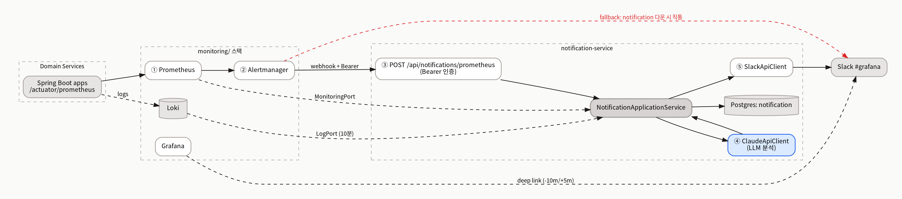
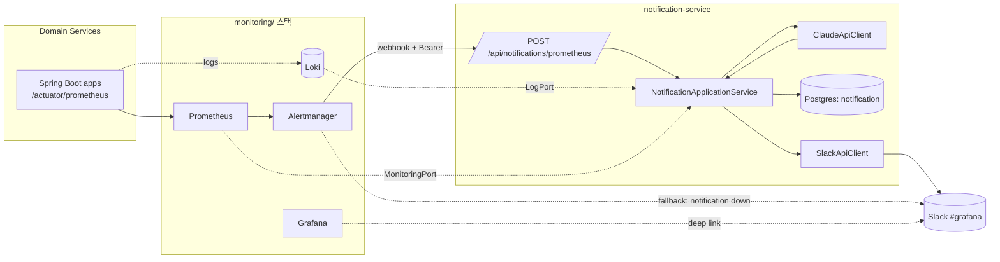
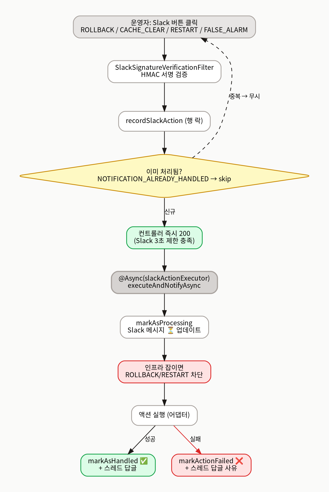
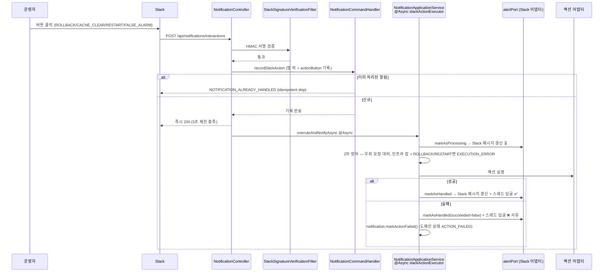
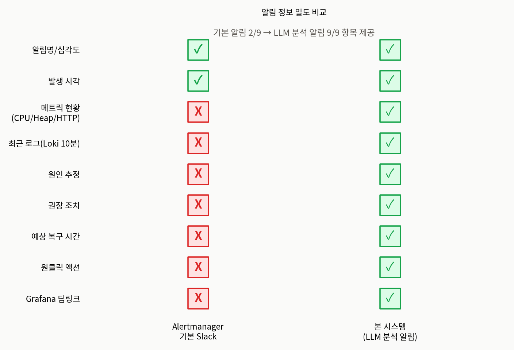

# AIOps 파이프라인 아키텍처 문서

| 항목 | 내용                                                                                  |
|---|-------------------------------------------------------------------------------------|
| 대상 서비스 | `apps/notification-service` + `monitoring/` 스택                                      |
| 작성자 / 갱신일 | 김단비 / 2026-05-18                                                                    |
| 다이어그램 | `./diagrams/` (`aiops-flow.png`, `aiops-hitl-sequence.png`, `aiops-comparison.png`) |

> PromQL은 `monitoring/prometheus/alert-rules.yaml`을 1차 출처로 인용한다. `infrastructureJobs` 등 변하기 쉬운 값은 본문에 박지 않고 "config로 주입"으로만 표기한다.

---

## 1. 개요 & 배경 (왜 AIOps 인가)

전통적 알림은 "무엇이 임계치를 넘었다"만 전달하고, 원인 추정·조치 판단·실행은 전부 운영자의 수작업이다. 본 시스템은 Prometheus 알림에 LLM 분석(원인 가설 + 권장 조치 + 예상 복구 시간)을 결합하고, Slack 메시지의 버튼으로 **사람이 승인하는** 조치 실행(Human-in-the-Loop)을 제공한다. LLM은 *권장*만 하고 실제 실행 권한은 항상 사람의 클릭에 있다 — 이것이 본 시스템의 핵심 원칙이다.

---

## 2. 시스템 컨텍스트

`notification-service`의 웹훅·인터랙션 엔드포인트는 게이트웨이를 우회해 직접 노출된다. 그래서 자체 인증 메커니즘이 두 개(웹훅 Bearer, Slack HMAC 서명) 박혀 있다.

Mermaid 원본 (편집용)

반드시 표현된 사항: ① Alertmanager → webhook 정규 경로와 Alertmanager → Slack 직통 fallback(notification-service 자신이 죽었을 때), ② `webhook.secret` Bearer 인증, ③ LLM 호출과 메트릭/로그 보강이 동일 스레드에서 발생.

---

## 3. Human-in-the-Loop 시퀀스

5단계 파이프라인은 Prometheus → Alertmanager → Webhook → LLM → Slack이다(전체 흐름은 §2 다이어그램). 운영자 버튼 클릭 이후의 HITL 흐름은 다음과 같다.

Mermaid 원본 (편집용)

**도메인 상태 전이와 Slack 메시지 갱신의 분리.** 위 시퀀스에서 `markAsProcessing` / `markAsHandled`는 도메인 상태 전이가 **아니라** `alertPort`(Slack 메시지 시각화 어댑터) 메서드다. 도메인 모델 `Notification`의 실제 상태는 4개(`PENDING / SENT / FAILED / ACTION_FAILED`)뿐이며, 버튼 클릭·액션 처리 중에도 도메인 상태는 `SENT`에 머문다. 액션 실패 시에만 `markActionFailed()`로 `SENT → ACTION_FAILED` 전이가 일어난다.

Slack 단계의 모든 호출은 `trySlack`으로 격리되어, Slack 장애가 메인 흐름·액션 결과를 무효화하지 않는다.

> 한계: `AlertStatus`는 RESOLVED/ACK 상태를 가지지 않는다. "정상화"는 Slack 액션(`FALSE_ALARM` 또는 다른 액션 결과)으로만 표현된다.

---

## 4. 알림 규칙 카탈로그

`monitoring/prometheus/alert-rules.yaml`의 현재 7개 룰을 그대로 인용한다.

| 알림명 | PromQL (요약) | for | severity | 의미 / LLM 분석 함의 |
|---|---|---|---|---|
| HttpErrorOccurred | `increase(http_server_requests_seconds_count{status=~"[45].."}[5m]) > 5` (by job/status/uri/exception) | 2m | warning | 5분 4xx/5xx 누적. 상태·예외 라벨이 LLM 프롬프트에 직접 전달 |
| ServiceDown | `up == 0` | 1m | critical | 프로세스/Eureka 다운. notification-service 자신이면 Slack 직통 |
| HighCPU | `process_cpu_usage > 0.8` | 2m | critical | JVM CPU 80%↑. 동시 다발 시 트래픽 폭증/무한루프 의심 |
| HighMemory | `(jvm_memory_used_bytes{area="heap"} / jvm_memory_max_bytes{area="heap"} > 0) > 0.8` | 2m | warning | Heap 80%↑. 분모>0 가드 포함. GC overhead 동반 시 누수 의심 |
| HighGcOverhead | `jvm_gc_overhead_percent > 0.1` | 5m | warning | GC 10%↑ 지속 |
| ConnectionPoolNearExhaustion | `hikaricp_connections_active / hikaricp_connections_max > 0.9` | 2m | warning | 풀 90%↑ |
| ConnectionPoolPending | `hikaricp_connections_pending > 3` | 1m | critical | 획득 대기 → 풀 고갈 임박 |

공통 라벨은 `job`, `instance`, `severity`이며 `HttpErrorOccurred`만 `uri`, `status`, `exception`을 추가한다. 현재 임계값은 팀 합의 기반 초기 기본값이며, 운영 데이터 누적 후 튜닝 대상이다(Backlog 항목).

### Alertmanager 라우팅

| 매치 조건 | 수신자 | 의도 |
|---|---|---|
| `alertname =~ ServiceDown\|HighCPU\|HighMemory` AND `job = antcamp-notification` | `slack` (직통) | notification-service 자기 자신 이상 시 webhook 호출 불가 |
| 그 외 모든 firing | `notification-webhook` | 정규 경로(웹훅 → LLM → Slack) |

`group_wait=0s`(즉시 발송), `group_interval=30s`(동일 그룹 추가 알림 묶음 주기), `repeat_interval=1h`(미해결 알림 재통지 주기).

> **현 결정의 한계.** fallback 매치 룰이 `ServiceDown|HighCPU|HighMemory` 로만 제한되어, `HighGcOverhead` 등 notification-service 자체의 다른 알림은 여전히 webhook 경로에 의존한다 — 자기 모니터링 사각지대. 매치 룰 확장이 다음 재검토 시 우선 항목.

---

## 5. LLM 분석 단계 상세

**언제 호출되는가**: `MonitoringMetrics#isValid`가 true일 때만. 메트릭 수집 실패 시 LLM 분석은 스킵하되 알림 자체는 발송한다(가시성 유지).

**무엇을 입력하는가** — 프롬프트 변수 매핑:

| 변수 | 출처 |
|---|---|
| `alertName`, `firedAt`, `severity`, `job`, `instance`, `summary`, `description` | Alertmanager 페이로드 |
| `uri`, `httpStatus`, `exception` | HttpErrorOccurred 룰의 라벨 |
| `cpu`, `heap`, `errorCount`, `avgResponseTime` | `PrometheusApiClient` |
| `recentLogs` | `LogPort` (Loki 최근 10분) |

**출력 규약**: Slack mrkdwn, 2,000자 이내, 코드블록·표·구분선 금지, 정해진 섹션(`*🔍 원인 분석*`, `*🚨 권장 조치*`, `*⏱️ 예상 복구 시간*`). 규약 위반 시 `SlackBlockBuilder`가 자르거나 렌더링이 깨진다.

**모델/프로바이더**: 현재 Anthropic Claude(`ClaudeApiClient` 직호출). Spring AI 통합이 아닌 직접 호출이며(메시지 후처리·스트리밍 미요구 + 의존성 최소화 추정), 모델 교체 시 mrkdwn 출력 규약 회귀 테스트가 필수다.

**책임 분담**: LLM은 권장 조치만 제시하고 실제 실행은 사람의 Slack 버튼 클릭으로만 일어난다.

---

## 6. Slack 메시지 구조 & 액션별 흐름

메시지 블록 순서: ① 헤더 `🚨 [severity] title`(150자) → ② 콘텐츠(`AlertContentBuilder.buildContent`) → ③ divider → ④ AI 분석 `🤖 AI 장애 분석`(2,900자 컷) → ⑤ divider → ⑥ Grafana 딥링크(알림 시각 -10m / +5m) → ⑦ **액션 버튼 블록 (인프라 잡인 경우 블록 자체가 메시지에서 제외됨)**.

| 액션 | 실행 메커니즘 | 실패 시 처리 |
|---|---|---|
| ROLLBACK | docker-java 이전 이미지 태그로 컨테이너 교체 | `markActionFailed` + 스레드 답글 사유 |
| RESTART | docker-java 컨테이너 restart | 동일 |
| CACHE_CLEAR | Redis 패턴 삭제 | 동일 |
| FALSE_ALARM | DB 상태 갱신만 | — |

### 인프라 잡 보호 — 2단 방어

인프라 잡(`infrastructureJobs` 설정에 포함된 job 이름) 알림은 사람의 실수 클릭과 우회 요청을 둘 다 막는다.

1. **1차 — 메시지 단계 (`SlackBlockBuilder#buildAlertBlocks`)**: 인프라 잡이면 4종 액션 버튼 블록 자체를 추가하지 않는다. 사용자에게는 클릭할 수 있는 버튼이 0개 노출되어 정상적인 경로로는 어떤 액션도 트리거 불가.
2. **2차 — 백엔드 단 (`NotificationApplicationService#executeAction`)**: API를 직접 호출하는 등 1차를 우회한 요청이 들어와도, `ROLLBACK`·`RESTART`는 다시 `infrastructureJobs` 화이트리스트로 차단하고 `EXECUTION_ERROR`를 반환한다. `CACHE_CLEAR`·`FALSE_ALARM`은 2차 단계에서 별도 차단이 없으므로(파괴적이지 않은 액션), 인프라 잡 보호의 1차 방어가 핵심이다.

> 동일 알림 재클릭은 `recordSlackAction`에서 `NOTIFICATION_ALREADY_HANDLED`로 무시되고, 롤백 이미지 부재 시 `ROLLBACK_IMAGE_NOT_CONFIGURED`로 실패 응답한다(상세 보장은 §7 NFR).

---

## 7. 비기능 요구사항(NFR) 매핑

| NFR | 보장 방식 | 근거 |
|---|---|---|
| 멱등성(중복 알림) | fingerprint 기반 분산락 1시간 TTL | `DeduplicationPort`, `processAlert` |
| 멱등성(중복 액션) | 행 락 + 상태 검사로 두 번째 클릭은 `NOTIFICATION_ALREADY_HANDLED` 로 무시 | `NotificationCommandHandler#recordAction`, `findByIdForUpdate` |
| 응답 지연(Slack 3초) | 액션 실행을 `@Async slackActionExecutor` 로 분리, 컨트롤러는 즉시 200 | `executeAndNotifyAsync`, `AsyncConfig` |
| 액션 사전조건 검증 | 롤백 이미지 부재 시 `ROLLBACK_IMAGE_NOT_CONFIGURED` 로 친절한 실패 | `RollbackPort` 어댑터 |
| 보안 — 웹훅 인증 | `Authorization: Bearer ${webhook.secret}` | `NotificationController#receivePrometheusAlert` |
| 보안 — Slack 인증 | HMAC 서명 검증 | `SlackSignatureVerificationFilter` |
| 인프라 보호 | 1차: 메시지에서 버튼 블록 제거(`SlackBlockBuilder`). 2차: 우회 클릭 대비 ROLLBACK/RESTART는 백엔드에서도 차단(`executeAction`) | `NotificationProperties.infrastructureJobs` |
| 자기 모니터링 | notification-service 자신의 critical 알림은 webhook 우회 Slack 직통 | `alertmanager.yaml` 라우팅 |
| 가관측성 | 알림 처리 로그 + 액션 결과 스레드 답글 | `NotificationApplicationService` |
| LLM 분석 누락 허용 | 메트릭 무효 시 분석 빈 문자열, 알림은 발송 | `processAlert` |
| 비용 통제 | 중복 제거로 1시간 1건, 메트릭 무효 시 LLM 미호출 | 위와 동일 |

---

## 8. 실패 모드 & 폴백

핵심 원칙은 **"LLM 분석이 빠져도 알림 자체는 항상 도달한다"**. LLM·메트릭·로그가 모두 옵셔널 컨텍스트로 취급되어 어느 단계가 죽어도 Slack 알림은 가시성을 잃지 않는다.

| 단계 | 폴백 동작 |
|---|---|
| Alertmanager → webhook (notification-service 다운) | 라우팅 매치 시 Slack 직통 — 알림은 도착, AI 분석 없음 |
| 메트릭 수집·LLM 호출 실패 | `isValid=false` 또는 분석 빈 문자열로 진행, 알림 정상 발송 |
| Slack 전송 실패 | `markAsFailed` 로 도메인 상태만 기록 — 재전송 경로 부재로 알림 미수신, DB-Slack 정합성 공백(현 구현의 미흡 지점) |
| 액션 실행 실패 | `markActionFailed` + 스레드 답글로 사유 통지, 사람이 재시도 |

---

## 9. 보안

외부 노출 엔드포인트(`/api/notifications/prometheus`, `/api/notifications/interactions`)는 게이트웨이를 우회하므로 자체 인증이 두 겹이다.

- **웹훅 Bearer 인증.** `webhook.secret` 으로 검증. 단, 현 구현은 시크릿이 `isBlank()` 일 때 검사를 스킵하므로 운영 환경에서는 시크릿 강제 주입 + 기동 시 검증 보완이 필수다(현 결정의 미흡 지점).
- **Slack 서명 검증.** `SlackSignatureVerificationFilter` 가 모든 `/interactions` 요청을 HMAC 검증.
- **관리자 조회 API (`/admin/**`).** 게이트웨이 JWT 검증 후 `X-Role` 로 권한 분기하지만 현 컨트롤러는 로그만 남긴다 — 추후 컨트롤러 레벨 가드 추가 검토.
- **액션 실행 권한.** docker-java가 호스트 Docker 데몬에 강한 권한을 가지므로 EC2 IAM/유저 권한 분리가 운영상 중요.

---

## 10. 비교: 기본 알림 vs LLM 분석 알림

| 항목 | Alertmanager 기본 Slack | 본 시스템(LLM 분석) |
|---|---|---|
| 알림명/심각도/발생 시각 | ✅ | ✅ |
| 메트릭 현황(CPU/Heap/HTTP) | ❌ (별도 대시보드) | ✅ (프롬프트 주입 + 본문 요약) |
| 최근 로그 | ❌ | ✅ (Loki 10분) |
| 원인 추정 / 권장 조치 / 예상 복구 시간 | ❌ | ✅ (LLM 분석 섹션) |
| 원클릭 액션 | ❌ | ✅ (4 버튼, 인프라 잡은 차단) |
| Grafana 딥링크 | ❌ | ✅ (-10m / +5m) |

> **도입 비용.** 호출당 Claude 토큰 비용 + 잠재 오탐 가능성이 추가된다. 중복 제거(fingerprint 분산락 1시간 TTL)로 동일 알림당 LLM 호출 1회로 제한해 비용을 통제한다.

---

## 부록. 운영 메모

- Slack `block_id` 형식: `alert_actions_<UUID>` — Slack API 255자 한계 내 안전.
- Grafana 딥링크 시간 범위: 알림 시각 -10m / +5m.
- 다이어그램 원본 Mermaid는 각 섹션의 `
` 블록에 보존되어 있어 수정·재생성이 가능하다.
- 실제 장애 시 LLM 분석 스크린샷·기본 알림 비교 캡처는 `docs/screenshots/aiops/`에 별도 보관한다.
