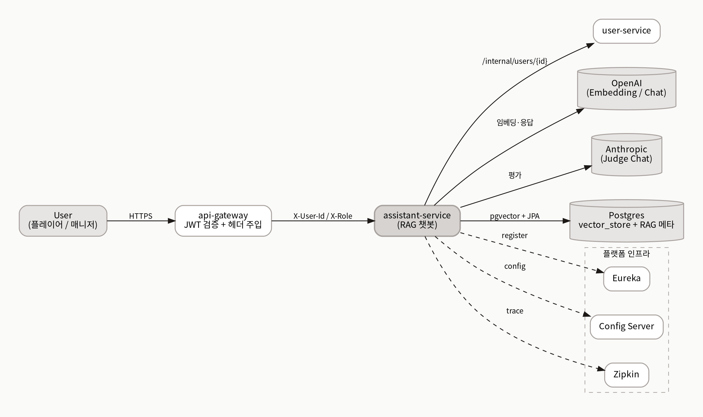
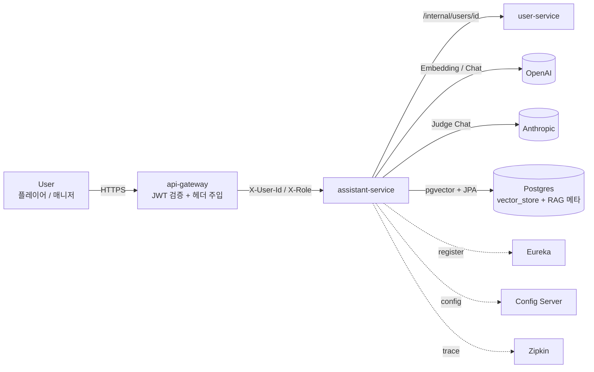
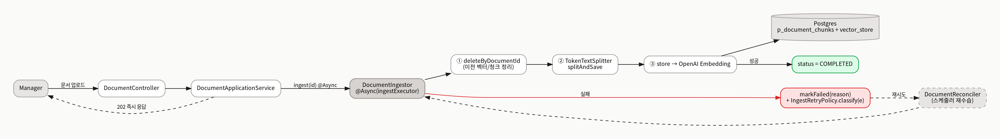
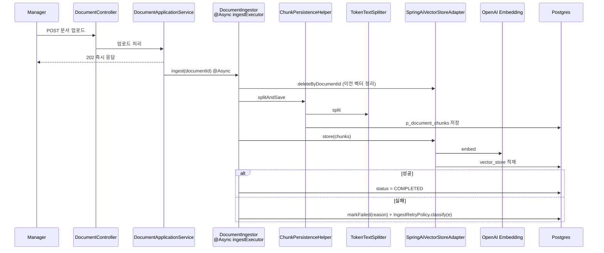
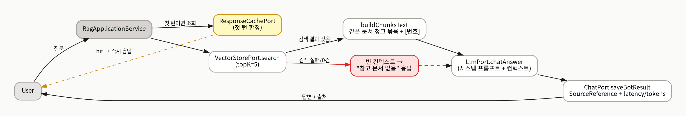
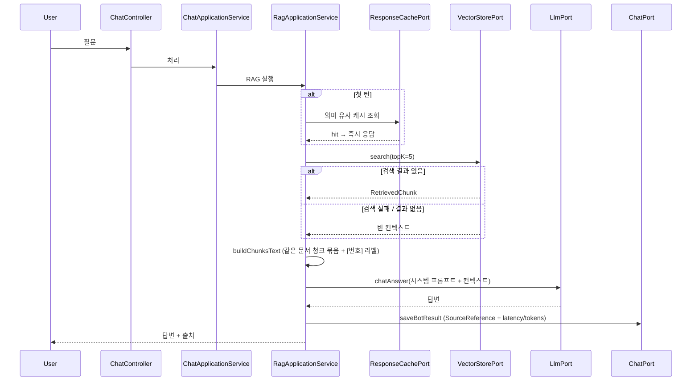

# RAG 파이프라인 아키텍처 문서

| 항목 | 내용                                                                    |
|---|-----------------------------------------------------------------------|
| 대상 서비스 | `apps/assistant-service`                                              |
| 작성자 / 갱신일 | 김단비 / 2026-05-18                                                      |
| 연관 문서 | [`rag-chunking-embedding.md`](rag-chunking-embedding.md) (청킹 & 임베딩) |
| 다이어그램 | `./diagrams/` (`rag-context.png`, `rag-ingest.png`, `rag-query.png`)  |

> 운영/배포: 모델·임베딩 설정은 config-server(`ants-camp-config/configs/assistant-service/`)에서 주입되며, `assistant-service`는 `notification-ec2` 그룹에서 배포된다.

---

## 1. 개요 (Why RAG)

`assistant-service`는 가상 주식 거래 경진대회 플랫폼의 도메인 지식(서비스 소개, FAQ, 이용약관, 운영 정책, 가이드)을 근거로 사용자 질문에 답하는 RAG 챗봇이다. 일반 LLM 단독 응답은 도메인 정책을 알지 못해 사실과 다른 답(hallucination)을 만들 위험이 크다. 따라서 도메인 문서를 청킹·임베딩하여 pgvector에 적재하고, 질의 시 관련 청크를 검색해 컨텍스트로 주입하는 Retrieval-Augmented Generation 구조를 택했다.

핵심 설계 원칙은 세 가지다. 첫째, 답변은 검색된 컨텍스트에만 근거하며 사전 지식 사용을 시스템 프롬프트로 금지한다. 둘째, 헥사고날 아키텍처 layering(presentation → application → domain, 도메인의 인프라 의존 금지)을 유지한다. 셋째, 모델 프로바이더와 임베딩 설정은 코드 상수가 아니라 config-server 외부 설정으로 주입한다.

📁 참조 코드: `application/service/RagApplicationService.SYSTEM_PROMPT_TEMPLATE`

---

## 2. 시스템 컨텍스트

`assistant-service`는 독립 모놀리식 챗봇이 아니라 MSA 모노레포 안의 한 서비스다. 외부 사용자는 항상 `api-gateway`를 거치며, 게이트웨이가 JWT를 검증하고 `X-User-Id`·`X-Role` 헤더를 주입한다. 서비스 자신은 인증을 다시 수행하지 않고 이 헤더를 신뢰한다.

Mermaid 원본 (편집용)

📁 참조 코드: `AssistantServiceApplication.java`, CLAUDE.md "Gateway authentication flow"

---

## 3. 도메인 데이터 모델

| 도메인 개념 | 영속 엔티티 | 책임 |
|---|---|---|
| KnowledgeDocument / DocumentChunk | `DocumentChunkEntity` (`p_document_chunks`) | 원본 문서 + 분할 청크. `type`이 메타데이터 `docType`의 분류 키 |
| 벡터 | pgvector `vector_store` (Spring AI 기본 스키마, 메타데이터 JSONB) | 청크 임베딩. 차원 변경 시 테이블 재생성 |
| RagQuery | `RagQueryEntity` | 질문·검색결과·프롬프트·응답·지연·토큰 추적 |
| ChatSession / ChatMessage | `ChatSessionEntity`, `ChatMessageEntity` | 멀티턴 대화 이력 |

📁 참조 코드: `infrastructure/entity/*Entity.java`, `SpringAiVectorStoreAdapter#deleteByDocumentId` (평가 엔티티는 §7)

---

## 4. 인제스트 파이프라인

문서 업로드 응답은 즉시 반환되고, 실제 청킹·임베딩은 `@Async("ingestExecutor")` 백그라운드에서 수행된다. 멱등성은 "이전 청크·벡터 삭제 → 신규 저장" 순서로 보장하며, 정리 단계가 실패하면 청킹을 중단하고 `markFailed`로 상태를 전이시킨다.

Mermaid 원본 (편집용)

반드시 표현된 사항: ① 업로드는 즉시 응답·인제스트는 백그라운드, ② `deleteByDocumentId → splitAndSave → store`의 순서적 멱등성, ③ 실패 시 분류 코드 기록과 스케줄러(`DocumentReconciler`) 재수습.

📁 참조 코드: `DocumentIngestor.java`, `ChunkPersistenceHelper.java`, `IngestRetryPolicy.java`, `infrastructure/scheduler/DocumentReconciler.java`

---

## 5. 추론 파이프라인

질의는 캐시 단락 → 벡터 검색 → 컨텍스트 빌드 → LLM 호출 → 출처 부착 순으로 진행된다. **캐시는 첫 턴(`llmHistory.isEmpty()`)에서만** 조회·저장한다. 후속 질문은 직전 문맥에 의존하므로 캐시 히트 시 오답 위험이 있다.

Mermaid 원본 (편집용)

검색이 실패하거나 결과가 없으면 빈 컨텍스트로 진행되고, LLM은 시스템 프롬프트의 "참고 문서 없음" 규칙에 따라 도메인 외 답변을 거절한다. 응답 반환과 별개로 검색 청크·출처·메트릭이 영속화된다.

📁 참조 코드: `RagApplicationService#buildChunksText`, `#buildSources`, `ResponseCachePort`, `VectorStorePort`, `ChatReconciler.java`

---

## 6. 멀티 프로바이더 LLM & 평가 파이프라인

응답 생성과 평가(Judge)는 `LlmPort` 인터페이스 뒤의 OpenAI·Anthropic 어댑터로 분리되며, `Provider` 라우팅이 저비용 모델을 우선 선택한다.

평가 파이프라인은 자동 질문 생성(`QuestionGenerationService`, 청크 내용을 ground truth로 사용) → 평가용 단일 RAG 호출(`runRagForEval`, 트레이스 보존) → 멀티 Judge 채점 및 평균 → 응답 모델과 Judge 모델이 같으면 self-preference bias 방지를 위해 skip 순으로 동작한다. Pairwise 비교와 프롬프트 버저닝, 평가 영속(`EvalRunEntity`, `EvalResultEntity`)도 지원한다. 상세 수치는 [`rag-chunking-embedding.md`](rag-chunking-embedding.md) §5.

> 한계: 자동 질문 생성이 청크 내용 자체를 정답으로 쓰므로 Recall@K 측정이 다소 낙관적이다. 정밀 평가가 필요해지는 시점에 사람 검수 골든셋을 별도 운용해 보정한다.

📁 참조 코드: `LlmConfig.java`, `Provider.java`, `OpenAiChatAdapter.java`, `EvalProcessor.java`, `QuestionGenerationService.java`, `PairwiseProcessor.java`, `PromptVersionApplicationService.java`

---

## 7. 비기능 요구사항(NFR) 매핑

| NFR | 보장 방식 | 근거 |
|---|---|---|
| 멱등 인제스트 | 재인제스트 시 기존 벡터·청크 삭제 후 신규 저장. 정리 실패 시 청킹 중단 | `DocumentIngestor#ingest`, `ChunkPersistenceHelper#splitAndSave` |
| 재시도 | `@IngestRetryPolicy.Retry` AOP, 예외 분류 후 영구 실패는 `markFailed` | `IngestRetryPolicy`, `SpringAiVectorStoreAdapter` |
| 비동기 처리 | `ingestExecutor`·`evalExecutor` 풀 분리로 인제스트가 추론·평가를 막지 않음 | `AsyncConfig` |
| 캐시 | 첫 턴 한정 의미 유사도 캐시. 후속 턴은 문맥 의존이라 의도적으로 미적용 | `ResponseCachePort`, `ResponseCacheConfig` |
| 보안 | 인증·인가는 게이트웨이, 서비스는 `X-User-Id`/`X-Role` 신뢰. 매니저 전용 API는 `ManagerRoleGuard` | `infrastructure/security/*RoleGuard.java`, CLAUDE.md |
| 비용 통제 | `topK=5` 고정, 캐시 단락, 저비용 모델 우선 라우팅 | `RagApplicationService.TOP_K`, `Provider` |
| 관측성 | Actuator + Micrometer + Prometheus + Zipkin(Brave) tracing | `build.gradle` |
| 데이터 무결성 | 외부 API/Feign 호출 구간은 `@Transactional` 미보유 (CLAUDE.md 규칙) | `RagApplicationService` 트랜잭션 경계 |

---

## 8. 실패 모드 & 폴백

핵심 원칙은 **"검색이 비어도 거짓 답변보다 거절 응답"**. 벡터·LLM·캐시 어느 단계가 실패해도 도메인 외 답변으로 새지 않는다.

| 단계 | 폴백 동작 |
|---|---|
| 인제스트 (벡터 정리·청킹·임베딩) | `markFailed` + 분류 코드 기록, `DocumentReconciler` 스케줄러 재수습 |
| 추론 — 벡터 검색 실패 | 빈 컨텍스트로 LLM 호출 → 시스템 프롬프트의 "참고 문서 없음" 규칙으로 거절 응답 |
| 추론 — 캐시 장애 | 경고 로그만 남기고 RAG 파이프라인 정상 진행 |
| 추론 — LLM 호출 실패 | 한국어 일시 오류 메시지 응답 저장 |
| 답변 저장 DB 실패 | **현 구현 미흡** — 보상 트랜잭션 부재로 데이터 손실 가능 (backlog) |

---

## 9. 대안 설계 비교 (Why-not)

본 산출물 범위에서 가장 큰 결정 세 가지만 짧게 정리한다. 청킹·임베딩 후보 비교는 [`rag-chunking-embedding.md`](rag-chunking-embedding.md) §2.2·§3.1 참조.

| 선택지 | 채택 | 한 줄 근거 |
|---|---|---|
| 벡터 저장소 (pgvector vs Pinecone/Qdrant/Weaviate) | pgvector | 단일 Postgres 인스턴스에 포함되어 별도 인프라 운영 부담 없음 |
| 검색 전략 (밀집 단독 vs 하이브리드/Re-ranking) | 밀집 단독 | 도메인 문서가 평이해 단순 베이스라인이 충분. Recall@5 가 합격선을 하회하면 하이브리드(BM25 + dense) 도입이 다음 재검토 |
| 캐싱 범위 (첫 턴만 vs 전 턴) | 첫 턴만 | 후속 턴은 문맥 의존이라 전 턴 캐시 히트 시 오답 위험 |

---

