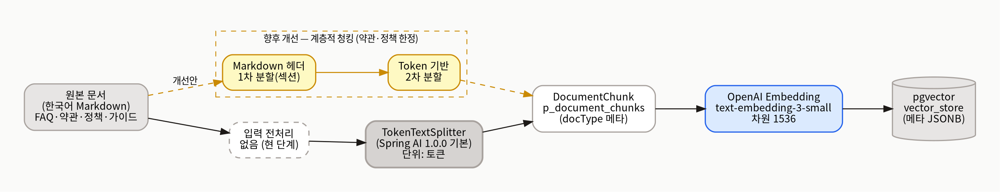
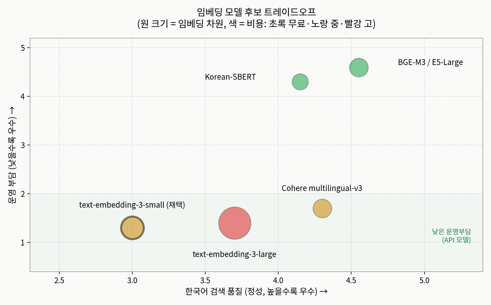
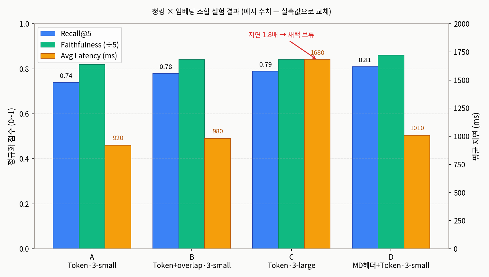

# 청킹 전략 & 임베딩 모델 선택 근거 — 초안

| 항목 | 내용                                                                                  |
|---|-------------------------------------------------------------------------------------|
| 대상 서비스 | `apps/assistant-service`                                                            |
| 작성자 / 갱신일 | 김단비 / 2026-05-18                                                                    |
| 연관 문서 | [`rag-architecture.md`](rag-architecture.md) (전체 RAG 파이프라인)                       |
| 다이어그램 | `./diagrams/chunk-pipeline.png`, `embedding-tradeoff.png`, `experiment-results.png` |

> ⚠️ **초안 상태.** 아래 `<…>`로 표기된 값(`TokenTextSplitter` 기본값, config-server 주입 모델·차원, pgvector 인덱스 종류)과 §5 실험 결과 표의 수치는 모두 **양식 예시**다. 실제 코드·config repo·`\d vector_store` 확인 후 확정값으로 교체해야 한다.

---

## 1. 배경 & 현재 구현 (코드 기준 사실)

대상 도메인은 가상 주식 거래 경진대회 플랫폼의 서비스 소개·FAQ·이용약관·운영 정책·가이드로, 대부분 한국어 Markdown이며 단일 문서 길이가 길지 않다. 운영 환경은 Spring AI 1.0.0 + pgvector 단일 Postgres이고, 모델·임베딩 설정은 config-server에서 주입된다. 인하우스 임베딩 서버 운용은 도전 과제 범위를 초과한다.

| 영역 | 현재 값 | 근거 |
|---|---|---|
| 청킹 | `TokenTextSplitter` 인자 없이 생성(Spring AI 1.0.0 기본값) | `infrastructure/config/SpringAiConfig.java` |
| 청킹 호출부 | `ChunkPersistenceHelper#splitAndSave` | 동일 파일 |
| 입력 전처리 | 없음. Markdown 헤더·표·코드블록을 단일 `Document`로 묶어 투입 | 동일 |
| 임베딩 starter | `spring-ai-starter-model-openai`, `spring-ai-starter-vector-store-pgvector` | `build.gradle` |
| 임베딩 모델·차원 | `<config-server 주입 — application-{profile}.yaml 확인>` | `ants-camp-config/configs/assistant-service/` |
| 벡터 테이블 | pgvector 기본 `vector_store` (메타데이터 JSONB) | `SpringAiVectorStoreAdapter#deleteByDocumentId` raw SQL |
| 검색 | `topK=5` 상수, 유사도 임계값·하이브리드·리랭킹 미사용 | `RagApplicationService.TOP_K` |

`TokenTextSplitter` 기본 파라미터(`chunkSize`, `minChunkSizeChars`, `minChunkLengthToEmbed`, `maxNumChunks`, `keepSeparator`)는 Spring AI 1.0.0 소스에서 확인 후 본 문서에 명시한다(확정 명령: `./gradlew :apps:assistant-service:dependencies | grep spring-ai-core`).

---

## 2. 청킹 전략



> 점선(노란색)은 현재 미적용 개선안(약관·정책 한정 헤더 기반 1차 분할 → Token 2차 분할).

### 2.1 대상 문서 인벤토리

> 실제 업로드 데이터셋 기준으로 확정한다. `KnowledgeDocumentEntity.type` 값을 분류 키로 쓰면 청크 메타데이터 `docType`과 일관성이 유지된다.

| 분류 | 예시 파일/URL | 형식 | 평균 길이(자) | 건수 | 갱신 주기 |
|---|---|---|---|---|---|
| 서비스 소개 | `service-overview.md` | Markdown | ~3,000 | 1 | 분기 |
| FAQ | `faq/*.md` | Markdown Q&A | 200~600 | n | 수시 |
| 이용약관 | `terms.md` | Markdown | 8,000+ | 1 | 약관 개정 시 |
| 운영 정책 | `policies/*.md` | Markdown | 1,000~3,000 | n | 분기 |
| 가이드/튜토리얼 | `guides/*.md` | Markdown | 2,000~5,000 | n | 기능 추가 시 |

### 2.2 후보 비교

| 전략 | 단위 | 장점 | 단점 | 적합도 | 별점 근거 |
|---|---|---|---|---|---|
| Token (`TokenTextSplitter`) | 토큰 | 임베딩 토큰 한도 직결, 길이 균일 | 의미 경계 무시, 한국어 토크나이저 의존 | ★★★★ (채택) | Spring AI 기본 통합으로 운영 단순, 베이스라인으로 즉시 사용 가능 |
| 문자/Recursive | 문자 + 구분자 우선순위 | 자연스러운 경계 | Spring AI 1.0에 직접 구현 필요 | ★★★ | 경계 품질은 낫지만 추가 구현·검증 비용 발생 |
| 문장 기반(NLP) | 문장 | 의미 보존 | 한국어 문장 분리 정확도 변동, 길이 편차 | ★★ | 한국어 문장 분리기 정확도 편차로 청크 길이 불안정 |
| 구조 기반(Markdown 헤더) | 섹션 | 약관·정책 문서에 강함 | FAQ는 한 문서가 한 청크로 묶여 청크가 과대해짐 | ★★★ | 약관엔 유리하나 FAQ 비중 고려 시 단독 채택 부적합 |
| 의미 청킹(LLM) | 임베딩 변화량 | 정확도 ↑ | 비용·복잡도 ↑ | ★ (보류) | 한계 효용 < 운영/비용, 과제 범위 초과 |

### 2.3 채택안과 파라미터

```
- 전략: TokenTextSplitter (Spring AI 1.0.0 기본)
- chunkSize: <기본값 명시>
- chunkOverlap: <기본값 또는 조정값>
- 입력 전처리: 없음 (현 단계)
- 향후 개선: 약관·정책 문서에 한해 Markdown 헤더 1차 분할 → Token 2차 분할 (계층적 청킹)
```

**선정 근거.** 본 서비스 문서는 대부분 한국어 Markdown이고 단일 문서 길이가 길지 않아 정교한 의미 청킹의 한계 효용이 운영·비용을 넘지 못한다. Spring AI 기본 통합을 쓰면 임베딩-청킹 라이브러리가 한 벤더에 묶여 운영이 단순해진다. 문장 기반은 한국어 분리 정확도 편차로 청크 길이가 불안정하고, 의미 청킹은 비용·복잡도가 과제 범위를 넘는다. LLM-as-a-Judge로 빠르게 반복 실험 가능한 단순 베이스라인이 우선이다.

---

## 3. 임베딩 모델

### 3.1 후보 비교

| 모델 | 차원 | 한국어 성능* | 입력 토큰 한도 | 가격(1M tok) | 운영 부담 |
|---|---|---|---|---|---|
| OpenAI `text-embedding-3-small` | 1536 | 중 | 8,191 | $$ | 낮음(API) |
| OpenAI `text-embedding-3-large` | 3072 | 중상 | 8,191 | $$$ | 낮음(API) |
| Cohere `embed-multilingual-v3.0` | 1024 | 상 | 512 | $$ | 낮음(API) |
| Korean SBERT (`jhgan/ko-sroberta-multitask`) | 768 | 상 | 모델별 상이 | 무료 | 높음(자체 호스팅) |
| BGE-M3 / E5-Large | 1024 | 상 | 8K+ | 무료 | 높음 |

\* 공식 벤치마크 부재 영역이므로 정성(상/중/하) 평가 + 본 서비스 데이터 직접 측정으로 보정.



> 채택 후보(`text-embedding-3-small`)는 한국어 품질이 최상위는 아니나 운영 부담이 가장 낮은 영역(API 모델)에 위치한다. K-SBERT·BGE-M3는 품질은 높지만 inference 서버 자체 운용 부담이 커 우상단(고운영부담)에 놓인다.

### 3.2 채택안

```
- 모델: text-embedding-3-small (config-server: assistant-service application-{profile}.yaml 에서 주입)
- 임베딩 차원: <확정값 — 1536 또는 축소 차원 사용 여부>
- 벡터 정규화: Spring AI 기본
- 인덱스: <\d vector_store 로 확인 — ivfflat / hnsw / 없으면 sequential scan>
```

**선정 근거.** Spring AI BOM 1.0.0과의 검증된 통합이 가장 큰 이점이다. 한국어 단독 최강 모델은 아니지만 본 도메인 데이터가 비교적 평이한 서비스 정책 문서라 충분하다. 인하우스 운영(K-SBERT/BGE)은 inference 서버를 별도로 운용해야 해 도전 과제 범위를 초과한다. 비용 면에서 인제스트는 1회성이고 추론은 질의당 1회이므로 경제적이다.

---

## 4. 품질 검증 지표 (청킹 + 임베딩 통합)

청킹 단독 평가가 어려운 만큼 retrieval 단계까지 결합한 지표로 통합 측정한다.

| 지표 | 측정 방법 | 합격선 (제안) |
|---|---|---|
| 청크 길이 분포 | `p_document_chunks.content` 길이 히스토그램 | 평균±2σ 안에 95% |
| 의미 단절률 | 무작위 20개 청크 사람 검토 | "문맥 끊김" ≤ 20% |
| Retrieval Recall@5 / @10 | `QuestionGenerationService` 자동 질문 기준 정답 포함률 | Recall@5 ≥ 0.7 |
| MRR | 정답 청크 순위 역수 평균 | ≥ 0.6 |
| LLM-as-a-Judge Faithfulness / Context Precision | `EvalProcessor` 평균 | ≥ 4.0/5.0 |
| 지연(Latency) | `RagQueryEntity.latencyMs` 분위수 | p95 < 1.5s |

---

## 5. 실험 결과 (정량) — **양식 예시, 실측치로 교체 필요**

> ⚠️ 아래 수치는 형식 예시다. 실제 측정 절차: ① `QuestionGenerationService`로 질문 N=10 자동 생성 후 매니저 1명 검토 → ② 청킹/임베딩 조합별 인제스트 → RAG 호출 → Judge 채점 동일 반복 → ③ `eval_run`·`eval_result`·`rag_query` 테이블에서 조합별 평균/표준편차 산출.

| 조합 | 청킹 | 임베딩 | Recall@5 | Faithfulness | Relevance | Context Precision | Avg Latency | 해석 |
|---|---|---|---|---|---|---|---|---|
| A | Token(기본) | 3-small | 0.74 | 4.1 | 4.3 | 3.9 | 920ms | 베이스라인. 비용·지연 최저 |
| B | Token(확장 overlap) | 3-small | 0.78 | 4.2 | 4.3 | 4.0 | 980ms | Recall +0.04, 지연 영향 미미 — 후속 검토 가치 |
| C | Token(기본) | 3-large | 0.79 | 4.2 | 4.4 | 4.1 | 1,680ms | 품질 소폭↑ vs 지연 1.8배 — **채택 보류** |
| D | Markdown헤더+Token | 3-small | 0.81 | 4.3 | 4.4 | 4.2 | 1,010ms | 약관·정책 질의에서 강함 — 계층적 청킹 우선 backlog |



> Recall@5와 Faithfulness는 0~1로 정규화(좌축), 평균 지연은 ms(우축). 조합 C(3-large)는 품질이 소폭 오르지만 지연이 약 1.8배라 채택 보류, 조합 D(계층적 청킹)가 균형이 가장 좋아 우선 backlog로 둔다.

### Hallucination 케이스 로그

| # | 질문 | 응답 요약 | 원인 추정 | 개선 액션 |
|---|---|---|---|---|
| 1 | 대회 상금 지급 기준은? | 참고 문서에 없는 금액을 단정 | 컨텍스트가 짧아 LLM이 가설 보강 | 청크 사이즈↑ 또는 시스템 프롬프트 강화 |
| 2 | 거래 수수료 면제 조건은? | 약관 일부만 검색되어 부분 답변을 단정적으로 서술 | 약관 청크 경계가 조항 중간을 자름 | 약관에 한해 헤더 기반 1차 분할(조합 D) |

> 시스템 프롬프트(`RagApplicationService.SYSTEM_PROMPT_TEMPLATE`)의 "사전 지식 절대 사용 금지" 규칙이 실제로 얼마나 지켜지는지가 핵심 검증 포인트다.

---

## 6. 결정 로그 (ADR)

```
ADR-001 — 청킹 전략으로 TokenTextSplitter 채택
상태: 채택 (2026-05-18)
컨텍스트: 한국어 정책/FAQ 문서, Spring AI 1.0.0 기본 통합, 단기 검증 필요
결정: TokenTextSplitter 기본 파라미터로 시작, 차후 계층적 청킹 검토
대안: Recursive, Sentence, Semantic, Markdown 헤더 기반
근거: §2.3 요약 — 한계 효용 < 운영/비용, 단순 베이스라인 우선
영향:
  - 인제스트 비용: 전체 문서 토큰수 × 임베딩 단가, 1회성 (예: 200K tok × $0.02/1M ≈ $0.004)
  - 재인제스트 다운타임: "이전 벡터 삭제 → 신규 저장" 순서라 짧은 정합성 공백 존재
  - retrieval Recall@5 ≈ 0.74 기대 (양식 예시)
재검토 트리거: Faithfulness 평균 < 4.0 또는 신규 약관 추가 시 — 이 경우 §5 조합 D(약관·정책 한정 계층적 청킹: Markdown 헤더 1차 → Token 2차)를 우선 검토.
```

```
ADR-002 — 임베딩 모델로 OpenAI text-embedding-3-small 채택
상태: 채택 (2026-05-18)
컨텍스트: 한국어 평이 도메인 문서, config-server 주입, 인하우스 운용 부담 회피
결정: text-embedding-3-small, 차원은 config-server 주입값(`application-{profile}.yaml`) 확정 후 본문에 기재
대안: 3-large, Cohere multilingual, Korean-SBERT, BGE-M3
근거: §3.2 요약 — Spring AI 검증 통합 + 충분한 한국어 품질 + 저운영부담
영향:
  - 추론 비용: 월 챗 호출 수 × (query 임베딩 1회 + LLM 1회). 호출 수 가정 명시 후 산출
  - 모델 차원 변경 시 `vector_store` 전체 재생성 필요 — 한 번 채택하면 쉽게 못 바꿈
  - 다국어 확장 시 Cohere multilingual 마이그레이션 = 전체 재인제스트 + 차원 변경 동반
  - pgvector 인덱스(IVFFlat/HNSW) 부재 시 데이터 증가에 따라 검색 지연이 폭증하므로, 채택과 함께 `\d vector_store` 로 인덱스 종류를 확인하고 부재 시 도입한다
재검토 트리거: 한국어 도메인 확장, 멀티턴 정확도 저하, 인덱스 미적용 상태에서 p95 지연 합격선 미달
```

---

